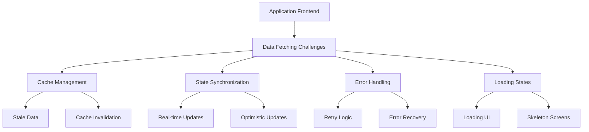
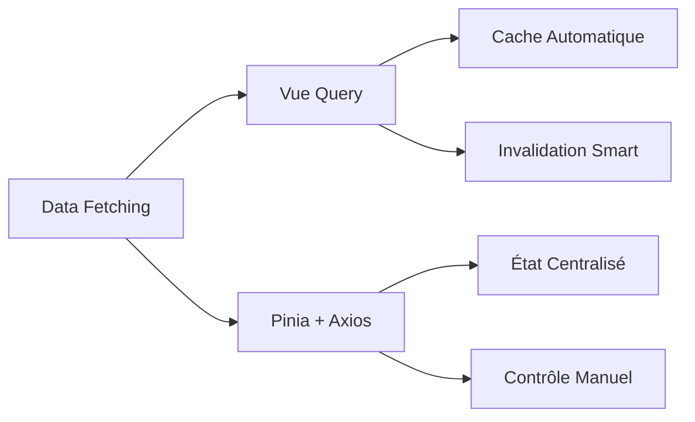

---
# You can also start simply with 'default'
theme: penguin
layout: intro
highlighter: shiki
title: Data Fetching en Vue 3 Naviguer entre Vue Query et Pinia.
info: |
  ## Slidev Starter Template
  Presentation slides for developers.
class: text-center
drawings:
  persist: false
# slide transition: https://sli.dev/guide/animations.html#slide-transitions
transition: slide-left
# enable MDC Syntax: https://sli.dev/features/mdc
mdc: true
themeConfig:
  logoHeader: 'https://www.sciredev.com/_vercel/image?url=%2Fimg%2Fauthor%2Fmagius.webp&w=320&q=100'
  eventLogo: 'https://media.licdn.com/dms/image/v2/D4D22AQFH7wpK7AsHvg/feedshare-shrink_2048_1536/B4DZRks1EgHIAo-/0/1736856261370?e=1740009600&v=beta&t=fq7z4T8QJA2-SDHJ18u1Y_rm5ZCDD9miCZo0KFL1agc'
  eventUrl: 'https://www.meetup.com/humantalks-nantes/events/304903323/?utm_medium=referral&utm_campaign=share-btn_savedevents_share_modal&utm_source=link'
  twitter: '@bearrDev'
  twitterUrl: 'https://twitter.com/bearrDev'
---

# Data Fetching en Vue 3
## Vue Query vs Pinia : Quelle approche choisir ?

<div @click="$slidev.nav.next" class="mt-12 py-1" hover:bg="white op-10">
  Pressez Espace pour commencer <carbon:arrow-right />
</div>

<div class="abs-br m-6 text-xl">
  <button @click="$slidev.nav.openInEditor" title="Open in Editor" class="slidev-icon-btn">
    <carbon:edit />
  </button>
  <a href="https://github.com/bertyn99/vue-query-presentation" target="_blank" class="slidev-icon-btn">
    <carbon:logo-github />
  </a>
</div>


---
layout: presenter
eventLogo: 'https://img2.storyblok.com/352x0/f/84560/2388x414/23d8eb4b8d/vue-amsterdam-with-name.png'
eventUrl: 'https://vuejs.amsterdam/'
twitter: '@bearrDev'

twitterUrl: 'https://twitter.com/bearrDev'
presenterImage: '/ef.jpg'
---
# Bertyn Boulikou

Developper fullstack freelance at 

- Nantes, France fr
- J'ecris souvent sur <a href="https://www.sciredev.com/blog"> sciredev.com/blog</a>
- Portfolio <a href="https://www.bertynboulikou.com/">ici</a>
- Faite un petit coucou at <a href="https://twitter.com/bearrDev"><logos-twitter mr-1 />@bearrDev</a>

---
layout: two-thirds
---

# Les Défis du Data Fetching

<v-clicks>

- Applications modernes plus complexes
- Multiplication des sources de données
- Besoins de performances accrus
- Expérience utilisateur fluide

</v-clicks>

::right::

<div class="">

</div>

---
layout: default
---

# Comparaison des Approches

<v-clicks>



</v-clicks>

---
layout: new-section
---

# Exemple Pratique : CRUD Basique


---
layout: code-group
---

# Exemple Pratique : CRUD Basique

::left::

```ts {all|2-6|8-12|14-21} {maxHeight: '400px'}
// Vue Query Approach
const useUsers = () => {
  const { data: users } = useQuery({
    queryKey: ['users'],
    queryFn: () => api.getUsers()
  })

  const createUser = useMutation({
    mutationFn: (newUser: User) => api.createUser(newUser),
    onSuccess: () => {
      queryClient.invalidateQueries({ queryKey: ['users'] })
    }
  })

  return {
    users,
    createUser,
    isLoading,
    error
  }
}
```

::right::

```ts {all|2-8|10-19|21-28} {maxHeight: '400px'}
// Pinia Approach
export const useUserStore = defineStore('users', {
  state: () => ({
    users: [],
    loading: false,
    error: null
  }),

  actions: {
    async fetchUsers() {
      this.loading = true
      try {
        const response = await axios.get('/api/users')
        this.users = response.data
      } catch (error) {
        this.error = error
      } finally {
        this.loading = false
      }
    }
  }
})
```

---
layout: comparison
---

# Points Clés de Différenciation

<div class="grid grid-cols-2 gap-4">

<div>
<h3>Vue Query</h3>
<v-clicks>

- Cache automatique ✅
- Invalidation intelligente
- Moins de boilerplate
- États de loading/error intégrés

</v-clicks>
</div>

<div>
<h3>Pinia + Axios</h3>
<v-clicks>

- Contrôle total sur le cache
- État centralisé
- Plus verbeux mais explicite
- Gestion manuelle des états

</v-clicks>
</div>

</div>

---
layout: demo
---

# Démonstration en Direct

```vue
<script setup>
// Exemple d'un composable avec Vue Query
const { users, createUser } = useUsers()

// Exemple d'utilisation
const handleCreate = async () => {
  await createUser.mutateAsync(newUser)
  // Cache automatiquement invalidé!
}
</script>

<template>
  <div>
    <UserList :users="users" @create="handleCreate" />
  </div>
</template>
```

---
layout: default
---

# Recommandations

<v-clicks>

- Vue Query pour :
  - Applications data-heavy
  - Besoins de cache sophistiqués
  - Moins de code boilerplate

- Pinia + Axios pour :
  - Contrôle précis du state
  - Applications plus traditionnelles
  - Équipes familières avec Vuex/Pinia

</v-clicks>

---
layout: default
class: 'w-full grid text-center align-self-center justify-self-center'
---

# Merci de m'avoir écouter.
[Présentation Repo](https://github.com/bertyn/vue-query-presentation)


